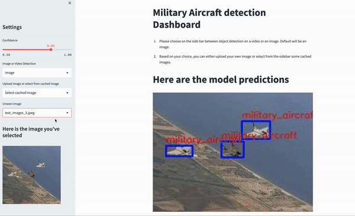

<div align="center">
<br/>

# Military Aircraft Detector
[](https://github.com/dmatgol/nato-ac-classifier/actions/workflows/main.yml)
</div>

**Goal:** Build an AI solution to quickly and efficiently identify military aircrafts in images and/or video.

**Context:** Given the current tensions between Russia and the West, and especially with the current War between Russia and Ukraine, it's more than ever very important to be able to have good military aircraft detection algorithms to safe and secure each countries' airspace.

**Dataset used to train the model:** Open source dataset available on kaggle: https://www.kaggle.com/datasets/a2015003713/militaryaircraftdetectiondataset


# Instalation

Please make sure you have `docker` and `docker-compose` installed.

1. **Run the application:**
```
docker-compose -f docker-compose_app.yml build
docker-compose -f docker-compose_app.yml up
```

Notes:
- Please give a bit of time for the application to start. Then, just go to `http://localhost:8501/` to see the dashboard. You can also see the fastapi swagger documentation if you go to `http://localhost:8001/docs`.
- The Pytorch image in the Dockerfiles is quite big, so please run this application with a machine with at least 16GB RAM. If you experience any problem, please try to increase the RAM that docker is able to use.

2. **Train the model:**

    1. First download the dataset.
    2. Export the path of the full dataset to the env variable `FULL_DATASET_DIR`. E.g.
    ```
    export FULL_DATASET_DIR=${PWD}/src/app/data/images_annotations
    ```
    3. Execute the instructions below:
    ```
    docker-compose -f docker-compose_train_model.yml build
    docker-compose -f docker-compose_train_model.yml up
    ```
